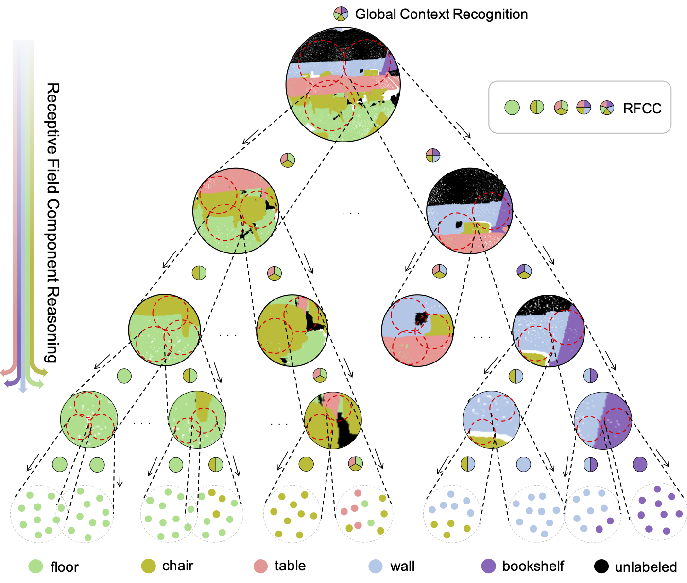

# Omni-supervised Point Cloud Segmentation via Gradual Receptive Field Component Reasoning
by Jingyu Gong, Jiachen Xu, Xin Tan, Haichuan Song, Yanyun Qu, Yuan Xie, Lizhuang Ma

<p align="center">  </p>
## Introduction
This project is based on our CVPR2021 paper. You can find the [arXiv](https://arxiv.org/abs/2105.10203) version here.
```
@misc{gong2021omnisupervised,
      title={Omni-supervised Point Cloud Segmentation via Gradual Receptive Field Component Reasoning}, 
      author={Jingyu Gong and Jiachen Xu and Xin Tan and Haichuan Song and Yanyun Qu and Yuan Xie and Lizhuang Ma},
      year={2021},
      eprint={2105.10203},
      archivePrefix={arXiv},
      primaryClass={cs.CV}
}
```
Hidden features in neural network usually fail to learn informative representation for 3D segmentation as supervisions are only given on output prediction, while this can be solved by omni-scale supervision on intermediate layers. In this paper, we bring the first omni-scale supervision method to point cloud segmentation via the proposed gradual Receptive Field Component Reasoning (RFCR), where target Receptive Field Component Codes (RFCCs) are designed to record categories within receptive fields for hidden units in the encoder. Then, target RFCCs will supervise the decoder to gradually infer the RFCCs in a coarse-to-fine categories reasoning manner, and finally obtain the semantic labels. Because many hidden features are inactive with tiny magnitude and make minor contributions to RFCC prediction, we propose a Feature Densification with a centrifugal potential to obtain more unambiguous features, and it is in effect equivalent to entropy regularization over features. More active features can further unleash the potential of our omni-supervision method. We embed our method into four prevailing backbones and test on three challenging benchmarks. Our method can significantly improve the backbones in all three datasets. Specifically, our method brings new state-of-the-art performances for S3DIS as well as Semantic3D and ranks the 1st in the ScanNet benchmark among all the point-based methods.

## ScanNet DataSet Segmentation
Under testing

## S3DIS DataSet Segmentation
Under testing

## Semantic3D DataSet Segmentation
Under testing

## License
This repository is released under MIT License (see LICENSE file for details).
